<h3>Hello There,</h3>

Today's world has changed a lot in the terms of Automation, and is moving at a very fast pace. This pace is maintained in the IT stream world through codes.

Codes have this power to just do any task if given the right commands.

AWS is a cloud Computing Platform that plays a very important role in maintaining the face paced world by providing the cloud serices that can help us maintain a system e.g, a WebSite and the best part is you dont have to buy the high-end resources but can easily rent it from AWS.

AWS is good, but using the Services via WebGUI takes time as it demands manual human interaction and also we need to manually go and configure all the services we need, that takes a lot of time.

Using a code that has all the needed things written will automatically configure all the things needed to be done manually...

For this code part we use <b>Terraform</b>.

Terraform is a tool that helps us to run any service on many Technological bases. This project needs its integration with AWS.

I assume that u have already done the prerequisite...

<ul>
  <li>You must have an IAM user account in the AWS with its credentials.</li>
  <li>You must have the AWS CLI setup in your BaseOS.</li>
  <li>You must have Terraform downloaded and also configured in the Environment Variables.</li>
</ul>

If all the above needs are met then we can start...

<ul>
  <li><b>First</b>
          We have to configure the IAM with the CLI and also give it a profile name...
    
   
   
   I have given the profile name as task1
  </li>
  <li><b>Second</b>
          We have to check if the Terrform is configured with the Terminal  we are using.
          We can do that by ...
  
  
  </li>
</ul>
  
  <h2>Lets dive into the code writing now...</h2>
  
  <b>NOTE</b>:
I have actually divided the code into sections to make the explanation easy, it needs to be written in a single file and is saved with the file name "ec2.tf"

  
  <ul>
  <li>
<h2>Step-1:</h2>
    First we need to write the provider so that terraform can just go and do all the required operation in it

    
  
  </li>
  <li>
<h2>Step-2: </h2>
  Create the key and security group which allow the port 80.

  
  
  
  </li>
  <li>
<h2>Step-3:</h2>
  Launch EC2 instance.
  
  Our main aim is to create a WebServer, so i have installed Apache server, php support and also git to help us perform all the required operations...
  

  
  
   </li>
   <li>
<h2>Step-4:</h2>
    In this EC2 instance use the key and security group which we have created in step-2 .
  
  

</li>
<li>
<h2>Step-5:</h2>
  Launch one Volume (EBS)
 
  
  
  
  
Mount that volume into /var/www/html
  
 
Developer have uploded the code into github repo also the repo has some images.Copy the github repo code into /var/www/html

 
 
  
  
To do the mounting and running commands, we need to use provisioner "remote-exec" and to do that we configure the remote...

  
  
</li>
<li>
<h2>Step-6:</h2>
 Create S3 bucket, and copy/deploy the images from github repo into the s3 bucket and change the permission to public readable.

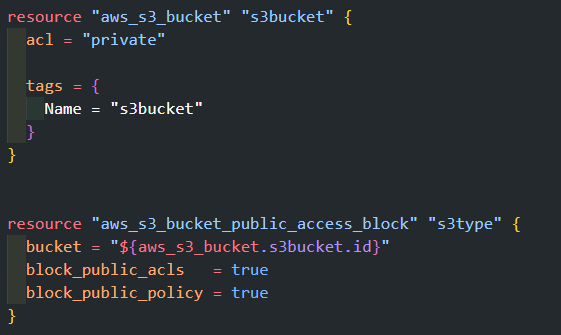

</li>
<li>
<h2>Step-7:</h2>
Create a Cloudfront using s3 bucket(which contains images) and use the Cloudfront URL to  update in code in /var/www/html

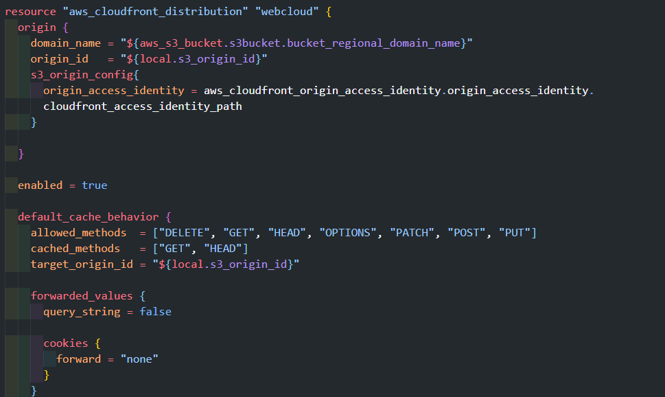
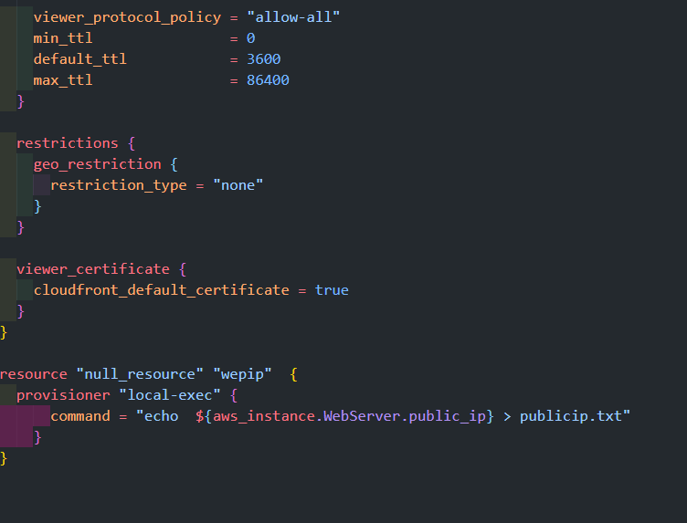

</li>
<li>
Now the code is complete and now its time to initialize so that it can download all the required plugins ...

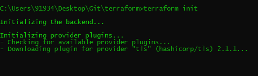
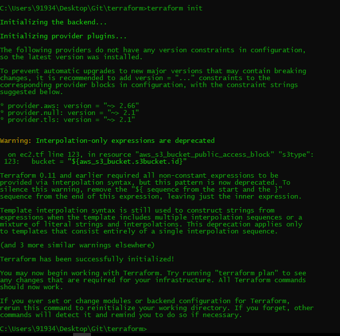

</li>
<li>
Now, its time to apply terraform...

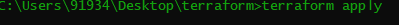

</li>
<li>
Now just review the changes and just type yes...
  
  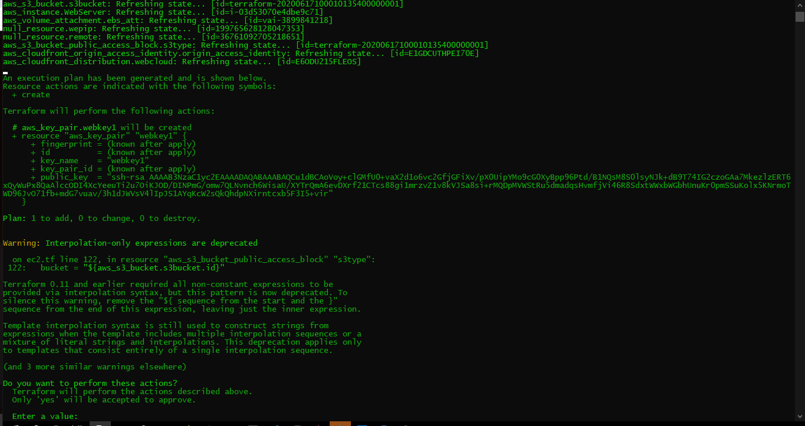
  
  
</li>
  <li>
Now, all of it is created.

  
  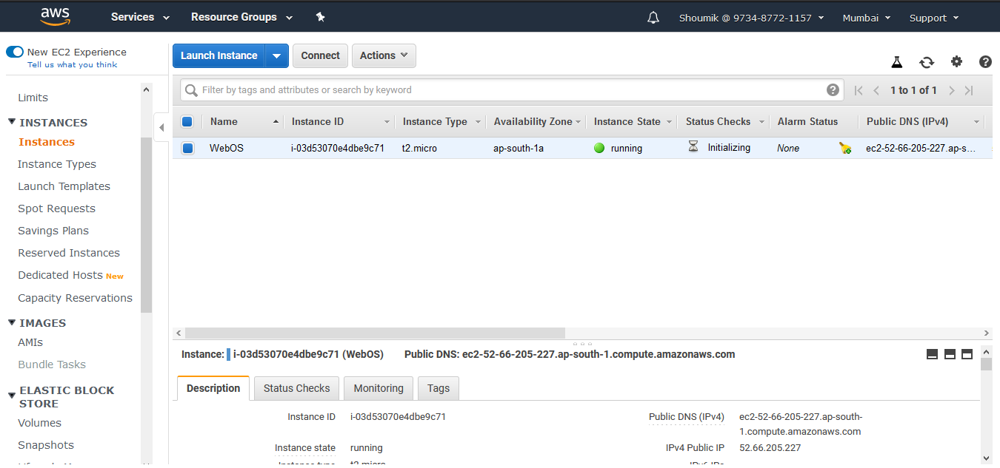
  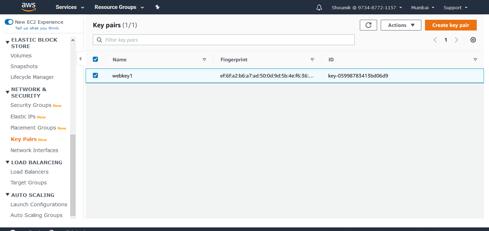
  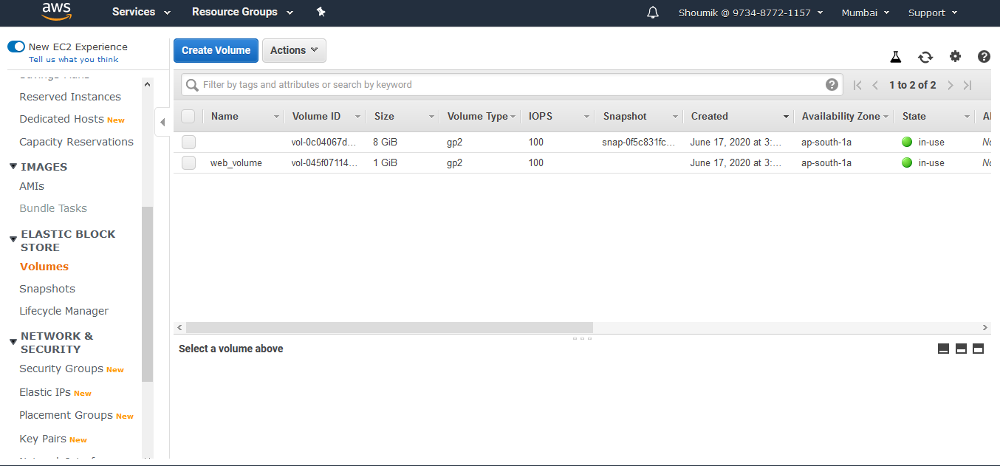
  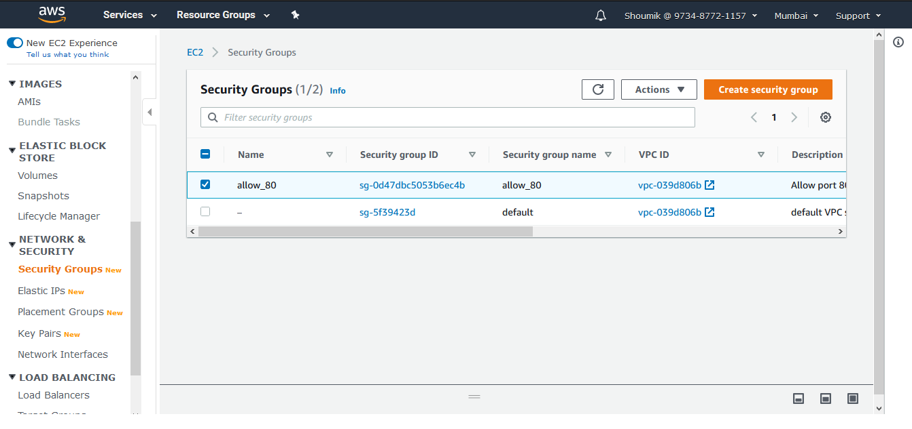
  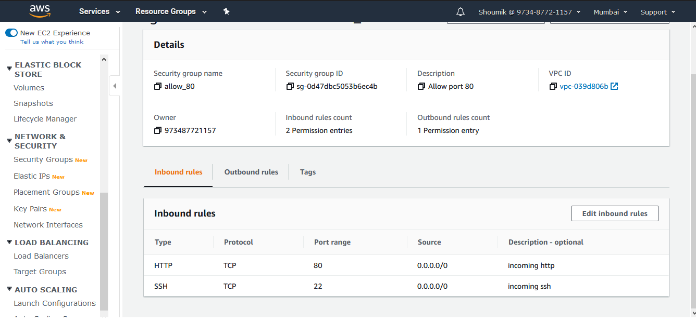
  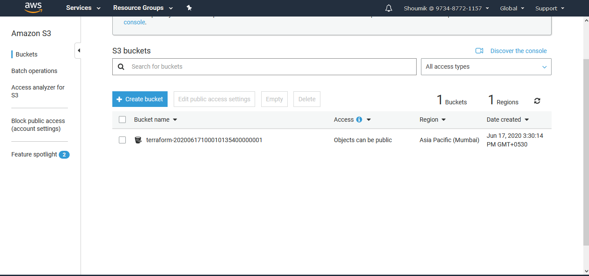
  
  </li>
  </ul>
  
At last the we created a WebServer that is fully based on Cloud...

  
  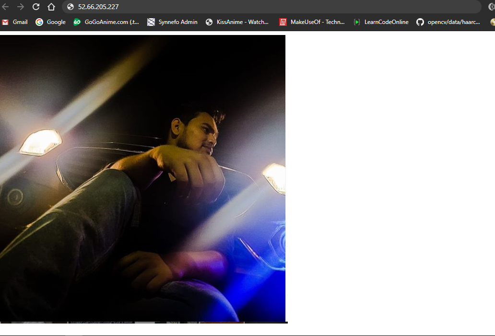
  
  
<h2>Thank You for your time. If you have any doubt feel free to contact via Whatsapp 9338455463(No calls plzzz)
    If you have any suggestion....Do contact on the same.</h2>

    
  
<h1>Thank you.</h1>

